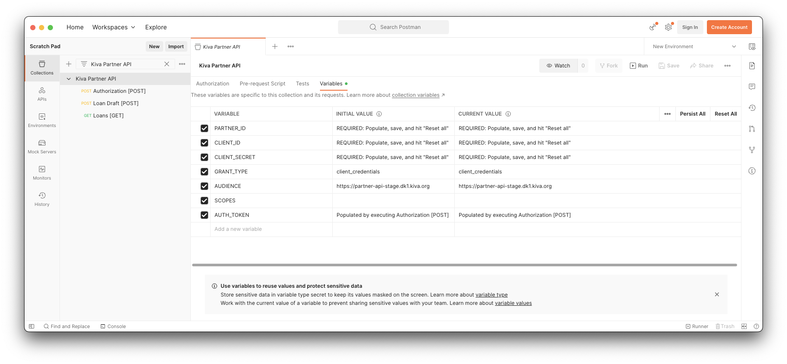
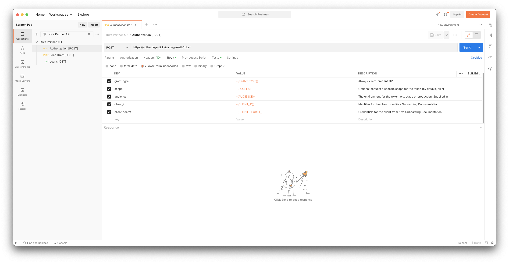
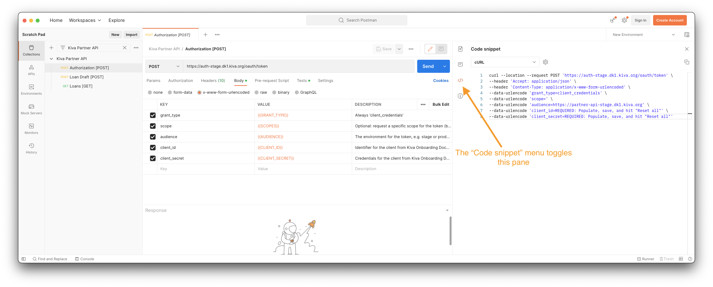
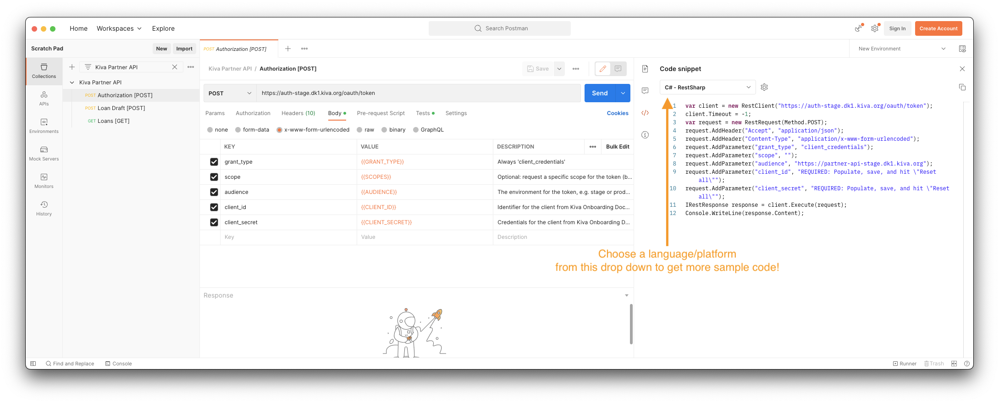

# Overview

Postman is a graphical application that can perform API calls. This repository contains a collection of example Kiva API
calls for integrating Field Partner data pipelines with Kiva's Partner Application (PA2).

With these examples and your partner setup information in hand, you'll be able to interact with our API to authorize
requests, draft loans, and more. This is a great hands-on way to understand how to build your Kiva API integration by
observing working examples, and we highly recommend beginning your integration by utilizing this collection to try out
the API. Postman can even generate [code snippets](#code-snippets) for many common platforms!

## Prerequisites

To use the collection, you will need the following information:

- Partner ID *(integer value)*
- Client ID *(text value)*
- Client Secret *(text value)*

If you do not have this information, please reach out to your Kiva Integration Coordinator.

## Getting Started

1. [Install](https://www.postman.com/downloads/) Postman.
2. [Import](https://learning.postman.com/docs/getting-started/importing-and-exporting-data/)
   the [collection](./collection.json).

### Variables Configuration

Open the Collection Variables tab. Populate the fields
from [Prerequisites](#prerequisites) into the `INITIAL VALUE` column of the `Variables` view, then press `Reset All` to
copy the values in the `INITIAL VALUE` column to the `CURRENT VALUE` column:

### Parameter Descriptions

We strive to include descriptions for parameters in the request. For instance, you can find descriptions for the body
parameters in the `Authorization [POST]` request:

## Postman Tips

### Code snippets

Postman can generate generic code snippets for a variety of languages and libraries:

## Troubleshooting

If you encounter a problem or an error with your request, please share the cURL request with your Kiva Integration
Coordinator. The cURL can be extracted from Postman's [code snippets](#code-snippets). **This is the absolute best way to
get help with your issues; it makes it possible for Kiva employees to rapidly reproduce your problem!**